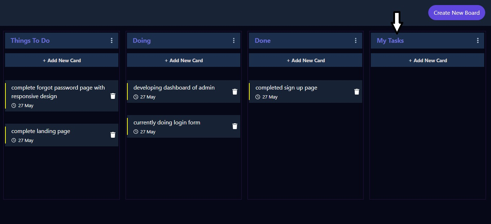

## Try this Draggable TODO List https://rushikeshpol15-dragable-todo-list.netlify.app/
# Draggable TODO LIST

### Draggable TODO List is the todo list where you can drag and drop your tasks seamlessly

- in this TODO List app four types of List is present
  1. Things TO DO
  2. Doing
  3. Done
  4. User created customizable List

## Technologies Used -

    1. React Js
    2. Bootstrap
    3. Sass

## Screenshots

;

- In Above image there is a add new card button where user can add task for that list
- Create New Board is the button where user can create his customizable task

;

- onclick on add new card button user will get a modal
- In which user can write the task and insert it into list.

;

- above image shows the data after succesfully added the task .

;

- on click on navbar create new board button
- the modal get visible for entering the custom board 

;

- after added board we can see  the new custom list is created 

### Draggin Effect

;

- Every card is dragable in above list
- when card is in dragging stage user can easily recognise by red color and able to see the location where he can drop the card there.
- in above image the thing to do lists element is dropping on doing list

;

- after the dropping card the list will be update
- in above match the card is droppped in doing list
which is previously in things to do list;

;

- User can create only one customise list
- after creating that he is not able to create more
  so  he will get a alert popup 
- total 4 lists are present 
 1. things to do
 2. doing
 3. done 
 4. custone list created by user 

;

- Every Card Have a Delete Feature where user can remove that card

;

- After deleting that card the list will get updated

;

- All The List are Responsive with drag and drop feature
